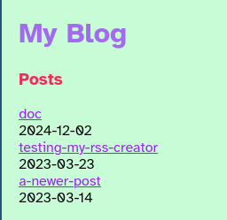
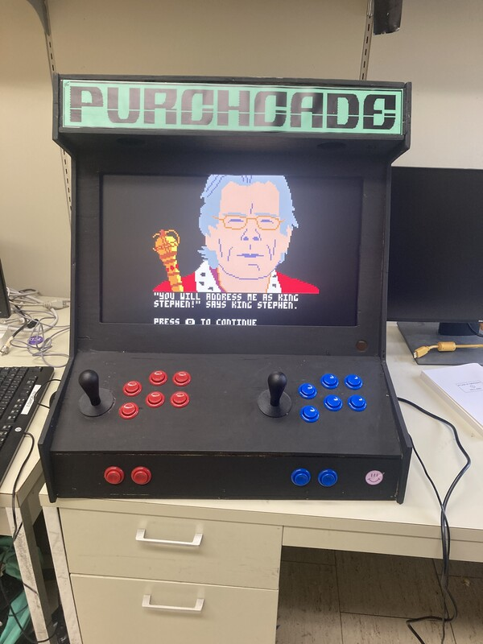
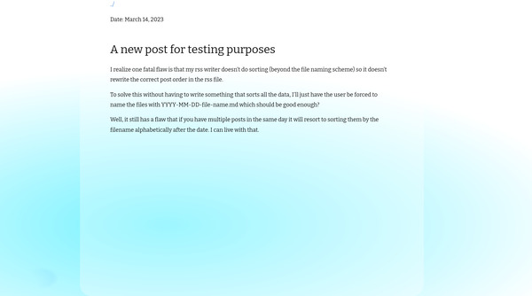
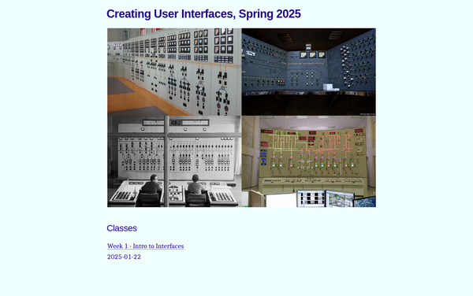
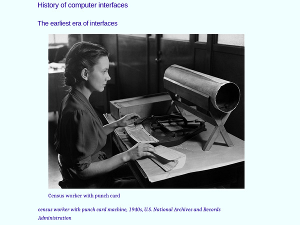
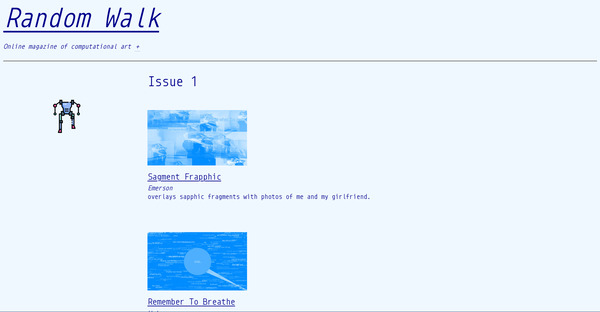

[←home](..)  
[↓Jump to present](#current)

## Preamble and Planning

I'm excited for [December Adventure](https://eli.li/december-adventure) 2024, where I'll code a bit every day of the month and write about it. Last year [I participated](https://leetusman.com/december-adventure-2023) and worked for a month on designing a new website. When the month ended I hadn't finished, and I ultimately made some different design decisions than I experimented with. But I did use a lot of the knowledge I gained, and I learned what I didn't want to do as well. In particular, I made comprehensive class-free CSS stylesheets, learned about automation with custom templates for pandoc, and developed approaches to building galleries with flexbox. I worked on image conversion scripts, and accessibility. I also learned about the limitations of using markdown and bash with variables as a templating language. All of this and much more I put to work in the class websites I made in the spring afterwards, and finally in my [website redesign](https://leetusman.com) that I completed in the spring.

This year, I don't have a single project but instead a number of little things I'm interested in exploring. I probably can't get to all of them. And I'll let myself wander depending on my interests. 

Currently, these are my ideas of things to play with:

* Work on an experimental narrative with recorded audio and 3d assets. Maybe in p5/WebGL, or maybe Lua
* Make a simple 3d environment in Godot, ideally with my own hand drawn assets
* Try out Construct 3 for rapid game-making
* Try out Jeffrey's [aesthetic.computer](https://aesthetic.computer).
* Complete my claw machine roguelike in Pico-8?
* Work on my Forth-based Processing-like little language, using SDL/Love2d on the backend
* revive the PocketChip, and try to see what I can do with it with its ancient OS
* Install alternative firmware for my Anbernic, and try adding the Pico-8 player to it and more roms
* Make some class sites with Hugo, possibly with Pandoc
* Play around with LOGO again, to prep for teaching with it in Drawing, Moving and Seeing with Code this spring

I probably will only try a small handful of these, but it's nice to have some options in mind.

Okay, I'll be back December 1. Let's see if I stick with this color palette!

## Nov 29

I started early.

I checked out [markdown-lichen](https://lichen.commoninternet.net/), a project by online/irl friends of mine. It's a gui wrapper around markdown-based static CMS. I did some testing in straight php and it worked mostly fine without being able to render built html pages. I had a chat with Max on Masto about implementing it to work without requiring docker, apache or nginx, since the goal is to be lightweight. They thought that should be doable. Will come back to this project and do more tests probably at that point. I guess I could always look into php myself but it does not fill me with joy. I'm hoping Max implements it, then I could add in documentation and run some tests.

Next I researched the [Picotron fantasy workstation](https://www.lexaloffle.com/picotron.php) to see if I wanted to purchase and play around with it. I found some cool projects, checked out the terminal, API, ran some programs online. Ultimately, I didn't find something to excite me enough to work on, so I'm going to pause on that for now.

Next, I worked on a web project. Some colleagues are in an exhibit opening in a month in LA and need a timebased 24-hour work to display in a website, updating once a second, as part of a show. Consider it something like a 24-hour long video with a framerate of 1 frame per second. They asked if I could make it happen. I developed a simple system and implemented a test, building out a simple site for them to check speed, image resolution, and for us to do some testing for robustness. Took me an hour or so for the initial test from idea to coding to deployment. Sent it along for their feedback. I should ask them for some money. I'll track my time. :)

By the way, this mini blog is being implemented in pandoc with front matter holding the title and css filename, and then just using a simple incantation in the terminal to render md to html.

## Dec 1

Okay, first official day of December Adventure. It's Sunday, and I spent much of the day staying warm, visiting Swiss Institute to see their current shows, and the tea shop and Ukrainian Village.

In the evening I decided to spend some time evaluating static site generators and to build one up because I've been unhappy with jekyll. For a decade I've mostly used jekyll, which has built-in support for GitHub pages. This means it's easy to host websites on GitHub written in Jekyll. But every few months when I try to make a post on one of my sites (class sites or project sites) I run into a problem and the site won't build due to dependency hell from some combo of Ruby, gems, or bundler dependencies. I don't want to use any of these. I've put checking out hugo on the back burner for a while, so now felt like a good time to spend a little time with it. 

I tried it in 2017, wasn't immediately noticing it to be much superior to jekyll, and haven't tried it out since but every time I complain about jekyll someone recommends hugo. So I checked it out! Unfortunately, to make a new site I have to invest time to figuring out directory structure, configuring templating and themes. And like Jekyll, it has many variables, and such to learn and implement. I know it's probably faster than building my own site from scratch but I got turned off. I didn't want to learn the hugo way. 

So next I fired Eleventy/11ty static site builder, and I check out the starter example on glitch.com. Based on this starter, the structure is pretty clear. The default nunjucks templating can be switched out for liquid templating, which might make it easier to switch. I do have to say I'm not thrilled about npm/node.js here as I fear there could be the typcial npm ecosystem of pulling in a million dependencies, and again dependency / version hell, though npx is to try to prevent this I guess. But based on being a retrogrouch I next pulled up bashblog, a ssg written in pure Bash. It's fine, though it spends a lot of lines adding in google analytics, disqus and twitter stuff, among other things I do not need or want. I also find the code hard to read since it's bash. And the default theme is ugly, and the project creator abandoned it, so maybe it wasn't great? 

To make a long story longer after all that I returned to my own custom bash and pandoc-based static site generator, panblog, which I started years ago. I had extracted minimal parts for powering this mini december-adventure site for example, so this was the kick in the pants to complete it, completing a build script, adding in theming, permalinks, index page builder, and auto-adding headers/footers, and rss feed generation. These are all things I already can do, so just need to automate it intelligently. 

So I picked up where I had left off working last time I touched the repo. Thankfully, I'm pretty good with documentation and left lots of notes. I decided to make some assumptions, but allow things to be easily changed. There is a config.conf file that holds the sub-directories for: themes, which are just css files; posts, which are markdown files with YYYY-MM-DD-name.md naming scheme; assets, the image assets source directory; templates, a folder holding html templates for pandoc to convert md to html for different kinds of pages; and some variables for holding the site name and url, for example. 

My build script creates a site folder if needed. It loops through the posts folder of markdown files, extracting the name and the date separately, via hacky regexes that took me a while to get right. My build script adds the post name and a link to the post page, inside its own directory, to the index page. It then adds the extracted date. It does this in reverse order so the most recent blog posts are at the top of the index. It uses pandoc to convert each post and the index page from markdown to html. I also set up a separate assets folder to hold images. Next steps are to add back in page conversion for non-blog pages, and then to test and automate the rss feed generator. Then to make sure I have some couple good basic and different classless themes. If all goes well, I think this could become my new static site generator for my uni classes, and maybe for my sites in general, and then maybe a good tool for other folks to use as well. It threads the needle between basic markdown to html conversion with straight pandoc on the one end and an overly complex ssg like hugo on the other. I think it's well on the way.



## Dec 2

Added a lot to my [panblog](https://tildegit.org/exquisitecorp/panblog) static site generator including a comprehensive build script, configs error checking, page rendering system, and documentation. I did a variety of tests and found a few bugs I still have to crack but am in overall good shape. 

## Dec 3

Much of the day has been consumed by me sitting on a couch with a laptop open and trying to crank out a professional document I have agreed to write, outside of my job but in keeping with the expectations of academia, to support faculty at another institution. It is not due until next Monday but the institution keeps asking me for it, so I'm trying to knock it out. Unfortunately it's been to the detriment to finishing up squashing bug on panblog. 

Anyway...I did get some time to work on it. So far I removed some old build scripts, tested my non-post page generation a bit, then added in some build automation to include opengraph (og:meta) tags, though ran into some issues when trying to populate the opengraph tags. 

Next I spent some time researching both metadata and front matter [variables](https://pandoc.org/chunkedhtml-demo/6.2-variables.html) in pandoc, with the goal to automate pulling a og:image url from frontmatter . I think I found a solution through the `--metadata KEY[=VAL]` option or the front matter, and finally found a [good explanation on stackoverflow](https://stackoverflow.com/a/26490978), that I think will be useful and I plan to use that to try to knock out remaining needs for populating variables. I also see useful info in the extensive man page `man pandoc` in the TEMPLATES section and then in Conditionals, which I think will be useful for testing if an image is set and then assigning the og:image metadata if it is.

Lastly for panblog, I began to rework gmi.css to an alternate "good defaults" new theme to ship with panblog. First, I checked out [2-color palletes](https://lospec.com/palette-list) from the Lospec website, and began trying some options, building out a new starter theme fresh.css.

Also, separately, I squashed a bug on [Archiving Artist-Run Spaces](https://leetusman.com/archiving-artist-spaces/) and added a redirect to my main/portfolio website in the /projects sub-directory in case anyone tries to manually go there directly (instead of to a project directly) so they are re-routed to root, which is the actual portfolio landing page, instead of a 404.

## Dec 4

Today I had meetings and taught my Programming Games class. Next week is the end of the semester so today I made a playtesting/coding day and the Learning Assistant and I went around meeting with students to help them squash bugs. We also talked about difficulty in games and tuning your game mechanics, and looked at examples of that across a few genres. The student projects are generally pretty great. I gave them the option of using Pico-8 or Love2d so there are lots of different kinds of projects, from platformers with bizarre mechanics, to race games, to experimental first person adventure stories. The biggest challenges my intro students deal with are writing collision detection for enemies, hazards, pickups, etc. The biggest challenge my advanced students have is reigning in their ambitious ideas that would take months of work and helping them shape a smaller, more doable multi-week project with the time allotted. I don't want to punish them for being ambitious, so usually I'll see if they can make just the first level, or a smaller component of their more ambitious game idea. This is especially important since they don't know to playtest and iterate and would tend to work in their head and solo until they finish, delivering a complete game before ever having another person try it out.



One of the senior students needed some extra credits so I asked him to work on a project this semester to build out a "bartop" arcade cabinet for student games. He made it out of plywood I purchased from the hardware store, and we ordered buttons and a controller from the internet. Then we raided my office stockpile of dumpstered keyboards, mice, monitors, etc that I've scavenged over the years, and used a Raspberry Pi from our spring [Special Projects in Tiny Computing](https://leetusman.com/tinycomputing_spring2024/) class. He installed RetroPie and Emulation Station and brought the nearly-finished machine, but we need to install Pico-8 and get EmulationStation to play it. I followed a [tutorial of sorts](https://www.reddit.com/r/RetroPie/comments/lurmu0/pico8_in_retropie_easy_uptodate_tutorial_with/) I found on reddit that seemed fairly comprehensive. First I had to escape out of EmulationStation and boot to the console. Hooking up Wifi on campus is a tedious process on campus involving registering the machine, visiting Campus Technology Services and the like. Rather than deal, I just plugged in directly to an ethernet port and got internet the ol'-fashioned way. I updated the computer, which took 15 minutes on the Pi, and then installed Vim so I could edit files. I downloaded some helper scripts from the tutorial onto my own laptop and installed them on one of my server spaces, then used wget in the terminal on the Pi to download and place them in the right places. I need to figure out how overscan works as I can't see the edge of the screen and thus it's hard to edit in the terminal. I don't have a regular GUI installed and didn't feel like going through the whole rigamorole to get that going, so I did my best to edit and tab around to see what I was typing, but mistakes were made! Eventually, all was well and I got Pico-8 to boot up. I couldn't quite figure out how the student had configured the controllers and they weren't working as I expected, so we'll plan to meet up tomorrow to try to finish up the controller scheme.

Finally, to procrastinate on finishing up the colleague review letter I worked on panblog a bit and continued hacking on a nice starter css theme for blogposts and index pages. I made a little test trying out a modification of a basic theme I started for a class website I taught in the spring. It's probably a bit "too much" for the out of the box theme but it would be nice to ship a few themes that are basically tiny css files since I feel most static site generators add that extra friction that you need to find themes and configure them when it could be as easy as just changing a single theme name in the front matter of a blogpost or page.



## Dec 5

Had our next-to-last Programming for Visual Artists class today. I showed students how to use CSS to affect the canvas, and how p5 fits into the rest of the browser ecosystem. I also showed them Processing in more detail, and when and how you may want to use it. For the rest of class students were given time to work on their final project due next week so I did lots of 1-on-1 meetings with students, debugging, talking through coding and conceptual ideas.

After class I met with J to get the controllers working on the arcade cabinet, which involves a lot of Bash scripts, configuration files and physical hardware. First I quickly cleaned up through a Bash script and some config files how Pico-8 works through EmulationStation. This will allow us to use EmulationStation as the back-end launcher so that in the future we can launch multiple game systems, and no keyboard required. Then we thought we were on a streak but we ended up spending 3 1/2 hours trying to get the darn 2 player joysticks and buttons mapped to the hardware correctly. Unfortunately we kept having weird problems like left/right being up/down, then we had left and right switched. Then we tried to fix it and I kid you not, the A button was now right joystick, seemingly at random. What a nightmare. The only good guide to configuring controllers we found and that seemed to work was on the [BBS forum](https://www.lexaloffle.com/bbs/?tid=38841). But eventually J found that a wire had fallen off the controller, and after reconnecting that, it solved one thing but we found we had other problems. We tried switching out controllers, swapping cables, un-connecting and reconnecting things, but each solution seemed to cause problems elsewhere. We guessed there is an intermittent short somewhere but lacked the energy to keep going because at that point, we'd put hours in and our brains were getting tired. So after all that time rather than leave defeated we got single player controller to work and will just have that mode ready for next week during final game presentation and arcade night, as I don't have time to work at school on this til the day of presentations. During the winter or spring we'll meet up again and try to get the second player controller working, and finally install the machine in the Lab. I'm a bit disapointed we aren't finished but it will be okay for next week because I think everyone turned in solo games for the Pico-8 assignment.

Aside from coding and teaching I also spent about 2 1/2 hours on the train and at home polishing up my letter of recommendation for a colleague and submitted it. I have to do 3 more (but easier) ones tomorrow!

## Dec 6

I think I got 90% of the MVP for panblog static site generator done. It's working well now, and I think the main thing left is to add correct OG:meta image variables and some project documentation, then start using panblog. What I have is a static site generator similar to others such as Jekyll and 11ty and Hugo, but simpler, with less variables and dependencies and the like, but fast. There is a single config.conf file where you put metadata such as website title, assets folder, site output folder, themes folder. There is a templates folder holding the site landing page and individual posts html template files. There are templates for header.html and footer.html files. You add posts to the posts folder in YYYY-MM-DD-name.md format, and use a standard markdown with frontmatter template. Images get checked in an images assets folder and on a post page you just write the image filename. After putting your post pages in the posts folder you just run the build.sh script to build the site. That's it! It's late so will have to get back to it tomorrow perhaps to finish the final details, but the todo seems not so bad: populating Opengraph image tag via frontmatter (might be tricky, hopefully not), adding conversion of non-blog pages (trivial), and then adding some documentation (fun). Finally, I'll want to see if I can build all my spring class websites using it quickly (3 sites). At some point I'll hopefully add in an image gallery template page and a project page template page as well from my website portfolio. Feels good getting to this point, and it uses knowledge I gained from my December Adventure time last year, then building the Archiving Artist-Run Sites project site and my website this summer.

## Dec 7

After a fun day out at the orchestra, then to see some sound art, then to dinner in Chinatown I came home. My partner wanted to see a movie I wasn't keen on so I put a few hours into panblog. It feels pretty close to completion for an alpha release. First, I fixed a number of bugs. Now, frontmatter is entirely optional. By default, the filename (e.g. *YYYY-MM-DD-a-title.md*) will be tokenized into a title and date, and all posts use the default site theme css file specified in the config.conf file. Optionally, other things can be set in the front-matter including: post title, theme to override the site default theme, an opengraph image url, and an opengraph description. Later, I may also add categories too and make an optional category page. I don't think it would be very difficult but I don't know if I need it, so maybe won't worry about that for my alpha release. Annoyingly, I spent over an hour or two trying to implement frontmatter custom variables with lua filters, bash, and then finally realized they're already implemented! It's just not well-documented in pandoc docs and I figured it out by perusing Pandoc's Issues on GitHub that they are already implemented and I just needed to use special syntax within my custom templates. I've updated my TODOs and see that the main thing left is testing: check that the RSS generator is generating a good RSS page; check that the rendered websites all work (need to try with other test sites). There may be a need to minorly debug the images asset folder if switching from title/index.html permalink to title.html. Speaking of which, uh oh, should I actually place all posts into an output posts folder? Otherwise they'll clog the output rendered site root directory. This would move them to _site_folder/posts/post_name/index.html for each. Well, I'll have to run some tests and see. Basically, I'll try to do a few tests on my own of these issues, make some sites, then announce and see if friends will test as well. I'm feeling good about where I'm at on this. It's at 99% of what I currently use Jekyll for.

## Dec 8

As I woke up this morning I dawdled in bed and read other folks' logs of December Adventure. From there I sailed from link to link and eventually landed on the blog of someone writing about Hugo, and then linking to its [quickstart](https://gohugo.io/getting-started/quick-start/). Let me apologize to Hugo that I now see the Quickstart is mostly straightforward and if I had seen it the first time without the ananke theme added I might have made a different choice just to go with it. For example, [smol](https://themes.gohugo.io/themes/smol/) theme seems to have 90% of what I'm looking for and no CSS pre-processor. It includes header/footer template code, though I'm not sure what calls it. And it's missing RSS, which I'm guessing is a tutorial somewhere else. So overall, a tutorial for Hugo quickstart but using smol theme and RSS, and some explanation or simplification of the header/footer would get to about where I'm at. It also has tags. I am far enough along that I'm not going to turn back now, because mine feels fairly feature-complete and mine is 200 lines and hugo, who knows, but probably in the tens of thousands of lines and a dozen or two build files. In any case, the advantages of Hugo within my own areas of focus: the option of mega more add-on features from external add-ons (though this is where things tend to get complicated, in my experience); an executable hugo file rather than pandoc being update via package management for example; image processing (to webp) in the extended edition, whatever edition means, though I could add imagemagick for processing easily. Okay, last I'll mention of hugo for now. 

Next I worked on my RSS feed generator. By the way, I'll bookmark this helpful stackoverflow answer on [yaml metadata in pandoc](https://stackoverflow.com/questions/26395374/what-can-i-control-with-yaml-header-options-in-pandoc) as its key to how I'm doing templating variables in panblog. When I need to grab a variable outside of a template I am using grep, like this:

```sh
# check if file has optional title in frontmatter
post_name=$(grep -oP '(?<=title: ).*' $file)
if [ -z "$post_name" ]; then #no title given, strip from filename
  post_name="${file_name//-/ }" #replace hyphen with space in name
fi
```

Next I ran tests on my RSS generator and though it validated through the w3 validator I thought I'd tweak it a bit. I pull in the title name or generate from filename, using code similar to the above codeblock. Then I added in guid for each post for best practices, but it's the same as a post url. I examined my generated rss file and it looked good. Then I ran it through the w3 validator again. All appears good.


Then I took a good long break and biked to Pioneerworks for the Press Play fair. Easily a couple thousand people there. I bought a sticker and some zines and mixtapes, and ran into a ton of friends. I saw Sam and Tega's open studio and caught up with them on Solar Protocol and their current projects. At night I came back and decided to fire up panblog to build a site. I started by copying my previous course website for Creating User Interfaces, which I last taught 2 years ago and have to teach this coming spring. It was easy to get the site up. I added in empty directories that panblog requires, posts, themes, templates, images; then copied over the build script, config.conf, and a css theme. I edited config.conf with my site URL, title and theme. I moved images over to the images directory. I edited the header and footer template lightly, changing out a line. Then I played around with CSS, and then...moment of truth...fired the build script up. Lovely! It works the first time! Fast. I noticed a minor bug, that the header wasn't included on the post_template and I fixed it on this site, plus went back and fixed it on panblog too. I decided I wanted the posts on this site to render from oldest on top to newest at the bottom, so I followed my own instructions to uncomment that option on the build script and commenting out the other way. It worked like a charm. 

Then I played around with the CSS, running build each time I made a change, and it worked fast and easily. I'm pretty happy with how everything turned out. See below pictures of the render site. Note: I added a drafts directory and moved all of the posts except for week1 into that. The drafts folder has no bearing on the rendering, so it's a fine way to hide stuff for later. Idea borrowed from other static generators. I'm not implementing something like "--build-drafts" or whatever. I never use that since it's easier to just check into posts folder when it's ready to test and build.





I'm feeling pretty great about this. I'll come back and do another site test for something different later, then announce and get friends to try it out, and then spread the word. It's great I've built this tool, something I've felt I've needed for years. Goodbye Jekyll! (Well, except for the two big projects I've built that rely on it and I'm not sure I want to switch them now because they rely on Liquid Templating. But one day, if I have to!)

## Dec 9

Today I prepped and pushed a v0.1alpha release of panblog. As it's pretty late at night, I'll try to announce to friends starting tomorrow and see if they want to try it out. I've also published a [demo site](https://exquisitecorp.tildepages.org/panblog-demo/), built using the the panblog repo "out of the box". In prep for that I pushed some fixes to build.sh, cleaned up the css template, and updated the demo posts with some additional text. Then I spent a little time reading up on hosting via [tildepages](https://tilde.wiki/Tildepages). It was pretty easy, but I did post the site to a separate repo to keep my original panblog software and the output separate (and because the panblog repo pushes the site to _site folder and I don't see a way on tildegit to specify a subdirectory the way you can on GitHub pages).

Earlier in the afternoon I worked on the timelapse website for my colleagues and built another test page for them to check out. It's like a very low, very slow flipbook, one image a second, all day, of plants germinating, growing. I will be taking a 24 hour video, converting it to still images, one per second, pegged to the exact hour:minute:second in the day. I decided to do this with front-end only and implemented an async promises approach to image-load. I don't have any previous experience with promises so looked at some examples and then tried to implement the idea myself. I used test video rendered to stills via ffmpeg for the test site I built. Now that the test site works the next step is to build the final site. I'll need to grab the huge multi-gigabyte video file and chop it up through ffmpeg and name the files based on HH-MM-ss. I may need some shell scripting to output each frame with the correct filenaming schema. Then I'll have to modify my code a bit. Finally, there is supposed to be a poem, some overlaid text on top of the image files so some CSS wrangling for that, especially if the site needs to work on mobile. I think I'll get back to this project next week after the semester ends.

In the evening I went to one of the book release events for Nick Montfort and Lillyan-Yvonne Bertram's (editors) anthology book OUTPUT which is a compilation of generated texts spanning from 1953 - 2023. 

Tomorrow I need to get back to working on the computational art website Random Walk that I'm building out with student artwork.

<div id="current"></div>

## Dec 10

A little coding today. I was working with a student on a project and we needed to figure out a flashlight-type effect where moving the mouse around illuminates hidden items in a dark scene. I tested out the mask procedure that's been added to p5 since I had last checked. But the way it works in an additive fashion didn't mesh well with how I was approaching it at first and I couldn't immediately get the specific result I wanted to get. So I quickly plunged into a bit of a brute force approach and I figured out a fake masking effect by creating a black opaque image twice as wide and twice as high as the screen dimensions, with a transparent circle in the center. This gets centered and drawn on screen at the coordinates of mouseX,mouseY. Moving that around as the player moves around illuminates the scene. Optionally, I could have the whole scene covered in complete darkness and switch to the one with the hole only when pressing down the mouse. I don't know if I'll need this again but it was a fun little test.

  

In the evening, I prepped the [Random Walk](https://randomwalk.club/) website to be ready for public release. Random Walk is my now online journal of computational art, inspired by [Taper](https://taper.badquar.to), [Oral.pub](https://oral.pub/) and the [HTML Review](https://thehtml.review/). In the first *issue* of Random Walk I published work from the students of my intro course Programming for Visual Artists. This is a class for students with no previous background in programming. They get a math credit, and I teach them how to make art with code. Of course we do cover all the basics from variables and functions to loops, conditionals, arrays, and objects, a graphics pipeline, working with media and sound. All that and fluxus, Yoko Ono, to the experiments at Bell Labs, to early net art and contemporary new media artists that work with code as medium. The idea for the online journal came to me last month when the students were giving presentations on their work and I was impressed by their work and what they had to say about it. I thought creating a website inspired by these other online journals could make a nice framing device, and I coded up most of the site around the Thanksgiving break. As well, I hope this site provides me some flexibility for future online computational art issues, perhaps from my Purchase College community, or perhaps beyond.

[↑top](#)
